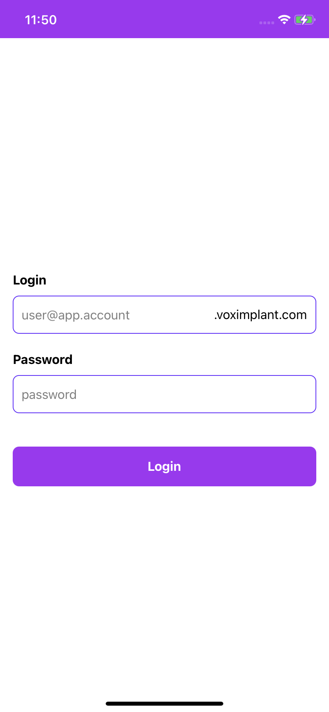
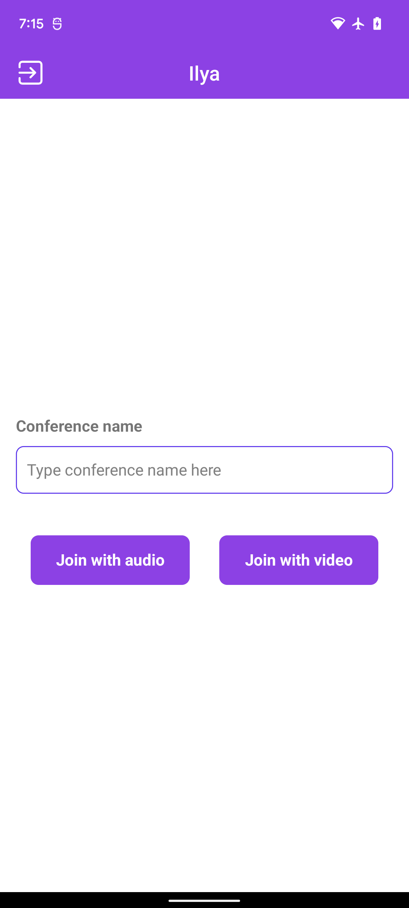
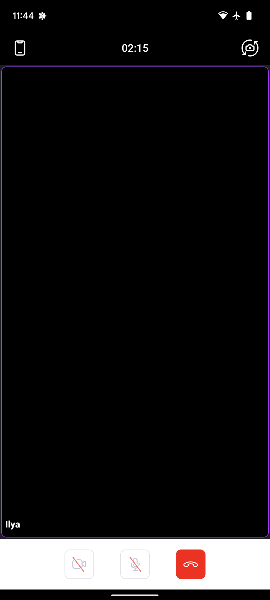
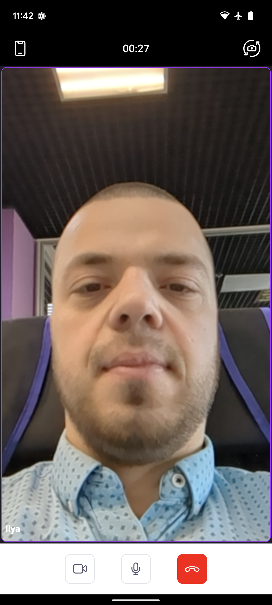
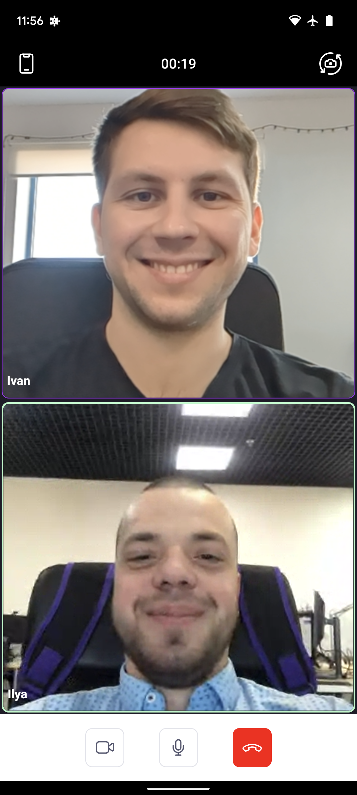
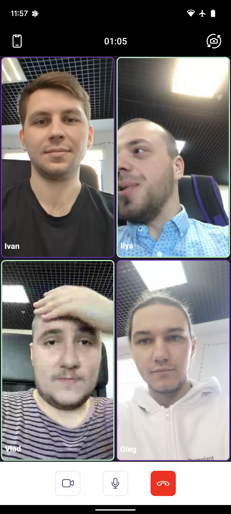
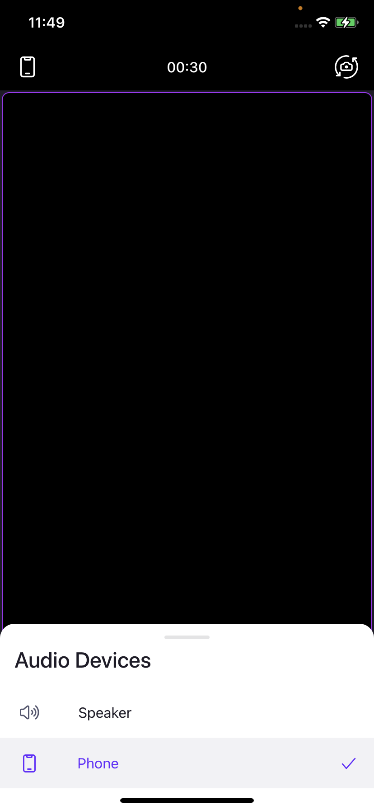

# React Native Conference Demo Application

The demo application that uses Voximplant React Native SDK and [Voximplant cloud platform](http://voximplant.com) for making conference calls.


## Features

The application is able to:
- log in to the Voximplant Cloud
- join a conference call
- layout for up to 6 conference participants
- enable/disable video receiving for conference participants 
- change an audio device (speaker, receiver, wired headset, bluetooth headset) during a call
- mute audio during a call
- start/stop sending video
- change video camera
- voice activity indicator for conference participants
- foreground notification with the ability to end a call on the Android platform


## Getting started

To get started, you need to [register](https://manage.voximplant.com/auth/sign_up) a free Voximplant developer account.
You'll need the following:
* Voximplant application
* two or more Voximplant users
* VoxEngine scenario
* routing setup
You can set up it manually using our [Getting started](https://voximplant.com/docs/introduction) page and tutorials


#### VoxEngine scenario example:

  ```
  require("conference");
  let conf;
  let log;
  let partsCounter = 0;
  const participants = new Map();
  // add a handler for the very first call which creates a conference
  VoxEngine.addEventListener(AppEvents.Started, function (event) {
    log = event.logURL;
    conf = VoxEngine.createConference({hd_audio: true});
    conf.addEventListener(ConferenceEvents.Stopped, function (event2) {
      Logger.write('Conference was stopped!');
      VoxEngine.terminate();
    });
    conf.addEventListener(ConferenceEvents.Started, function (event2) {
      Logger.write(`Conference is started ID: ${event2.conference.getId()}`);
    });
  });
  // create another handler for further incoming calls. The handler answers a call and connects it to the conference
  VoxEngine.addEventListener(AppEvents.CallAlerting, function (e) {
    participants.set(e.call.id(), e.call);
    e.call.answer();
    e.call.sendMessage(log)
    partsCounter = partsCounter + 1;
    const endpoint = conf.add({
      call: e.call,
      mode: "FORWARD",
      direction: "BOTH", scheme: e.scheme
    });
    Logger.write(`New endpoint was added ID: ${endpoint.id()}`);
    e.call.addEventListener(CallEvents.Disconnected, function (event2) {
      partsCounter = partsCounter - 1;
      if (partsCounter === 0) {
        setTimeout(checkForTermination, 1000 * 10); // wait for 10 ceconds
      }
      participants.delete(event2.call.id());
    });
    // add listener for sending messages
    e.call.addEventListener(CallEvents.MessageReceived, function (handleEvent) {
      participants.forEach((value, key, map) => {
        if (key !== handleEvent.call.id()) {
          let { muted } = JSON.parse(handleEvent.text);
          value.sendMessage(JSON.stringify({id: handleEvent.call.id(), isMuted: muted}));
        }
      })
    })
  });
  // create a function which stops a conference if there are no participants:
  function checkForTermination() {
    if (partsCounter === 0) {
      conf.stop();
      conf = null;
    }
  }
  ```


## Usage

### User login
<kbd>
  
</kbd>

Log in using:
* Voximplant user name in the format `user@app.account`
* password

### Join a conference call


Enter a Voximplant conference name to the input field and press "Join conference" button to make a call.

### Conference call controls
<table>
  <tr>
    <td>Conference screen without local video</td>
    <td>Conference screen with one participant</td>
    <td>Conference screen with two participants</td>
  </tr>
  <tr>
    <td></td>
    <td></td>
    <td></td>
  </tr>
  <tr>
    <td>Conference screen with three participants</td>
    <td>Conference screen with four participants</td>
  </tr>
  <tr>
    <td></td>
    <td></td>
  </tr>
  <tr>
    <td>Foreground service with 'HangUp' button action</td>
    <td>Conference screen with select audio device modal</td>
  </tr>
  <tr>
    <td></td>
    <td></td>
  </tr>
</table>

Mute, change an audio device or video sending during a call.


## Useful links

1. [Quickstart](https://voximplant.com/docs/gettingstarted)
2. [Voximplant React Native SDK reference](https://voximplant.com/docs/references/reactnative)
3. [Adding Voximplant SDKs to Your App](https://voximplant.com/docs/gettingstarted/makeanapp)
4. [Voximplant Conference Guides](https://voximplant.com/docs/guides/conferences/howto)


## Have a question

- contact us via `support@voximplant.com`
- create an issue
- join our developer [community](https://discord.com/invite/sfCbT5u)


